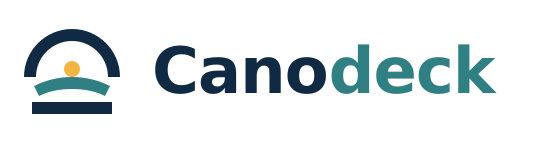
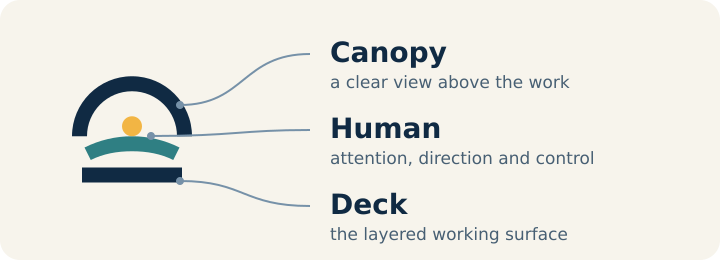

# Canodeck

> **Coming soon.** Canodeck is in active private development. This repository is a preview of the product direction, not a source release. Public source will arrive only after the working product is stable and its export has been carefully curated.



Running a few agent sessions is manageable. Running many is not. Work becomes spread across conversations, files and repositories, making it hard to see what needs attention, what each session is doing and where the work lives.

Harnesses and models also change quickly. You should not have to rebuild your working environment whenever one of its underlying tools changes.

Canodeck addresses both problems. It gives one person a single view over parallel agent work and uses stable contracts so harnesses, models and capabilities can be replaced or added. The human remains in control.

## Sessions, files and diffs in one view

Most agent harnesses tell you that a file was touched, then leave you to find it and work out why. Canodeck turns sessions, conversations, tool calls, files and diffs into one clear, richly rendered HTML view of what happened.

Canodeck is not an IDE. Agents edit the files; you review their work, select the exact part you want to discuss, and send it back to an agent. When you need the original harness, you can open its live terminal view with one click and return without losing your place.

Canodeck stays familiar when harnesses and models change. Plug-ins add them through declared capabilities instead of forcing you into a new working environment.

## Organized by subject, not by session

Work does not come in fixed sizes. A question can close the same day, return every month for a year, or grow into a project with several repositories and many sessions. You often cannot name or file it correctly at the start because its real shape only becomes clear while you work.

Subjects therefore develop with the work. They can be renamed, refined, split, merged or continued by another session without losing their history.

Canodeck organizes around the subject—the thing you are trying to achieve—not around a terminal window, repository, machine, harness or model. It follows how you think about your work, while the sessions underneath can start, stop and change.

## Lens, Method and Intelligence

```text
Canodeck
├── lens/           shows the work and carries human input
├── method/         defines how sessions work together
└── intelligence/   keeps the work intelligently organized
```

Each part answers a different question. **Method:** how do sessions work together? **Intelligence:** how does the work belong together? **Lens:** how does the human see and direct it?

### `lens/`: the five-panel interface

The Lens visualizes the state produced by the Method and Intelligence. It does not classify sessions, organize subjects or decide what should happen. It shows the result and passes explicit human input to the chosen session.

It replaces a wall of terminal windows with five connected panels:

1. **Fleet overview.** See work by subject, session, delegation, status or attention. Intelligence keeps related sessions together as subjects develop, split or continue across repositories.
2. **Files and commits.** Separate files a session read as input, files it wrote and files it only referenced. Move through that work by folder, time, repository or commit instead of hunting for paths in another tool.
3. **Rendered files and diffs.** Open Markdown, images, diagrams, source files and commit details as rich HTML. Switch between the live file, its committed version and its upstream diff, then select the exact passage you want an agent to address.
4. **Rendered and raw conversations.** Read the conversation as a clean narrative, expand tool calls and execution details, or switch to the raw live harness when you need the exact terminal view.
5. **Pinned input.** Pin an input target, then type, dictate, paste or send a selection while you continue browsing elsewhere.

Selecting a subject, session, file or commit updates the other panels around it. You move from overview to detail and back without searching through windows or reconstructing context.

### `method/`: roles and coordination

The method gives parallel work a shared discipline: clear roles, an explicit lifecycle, handovers and communication between sessions. It does not replace the coding harness or rebuild a project framework.

That is why it is harness-neutral. The contract describes responsibilities and authority—who may coordinate, execute or report—not one vendor's commands. Plug-ins translate those contracts and expose only the actions their harness actually supports.

Sessions communicate through the product-neutral `fleet-ask`, `fleet-answer`, `fleet-askback` and `fleet-sessions` family. Here, `fleet` names the communication mesh. Every session can use it; it is not limited to sessions with a fleet-wide scope.

### `intelligence/`: active organization

Intelligence is the active organizing layer. It follows how work develops across sessions and repositories, recognizes what belongs together, maintains subjects and relationships, summarizes long-running work and surfaces open questions.

This is what keeps the overview useful as the fleet grows. Instead of asking you to name and file every session in advance, Intelligence continuously maintains the map. You can correct that organization whenever the work means something different to you.

## Human control

You decide what matters, direct the work, resolve ambiguity and approve consequential changes. Canodeck makes that easier from one place.

You also decide where input goes. Canodeck sends each action to the session you choose, even while you browse somewhere else.

## Name and logo

**Cano** comes from *canopy*: the view above the work. **Deck** is the working surface beneath it, with clear layers and places. Together they describe one place from which you oversee and direct coordinated agent work.

The mark tells the same story. The navy arc is the canopy. The amber point and teal curve form a subtle human figure. The lower bar is the deck. The human sits inside the system, above the working layers and in control of them.


